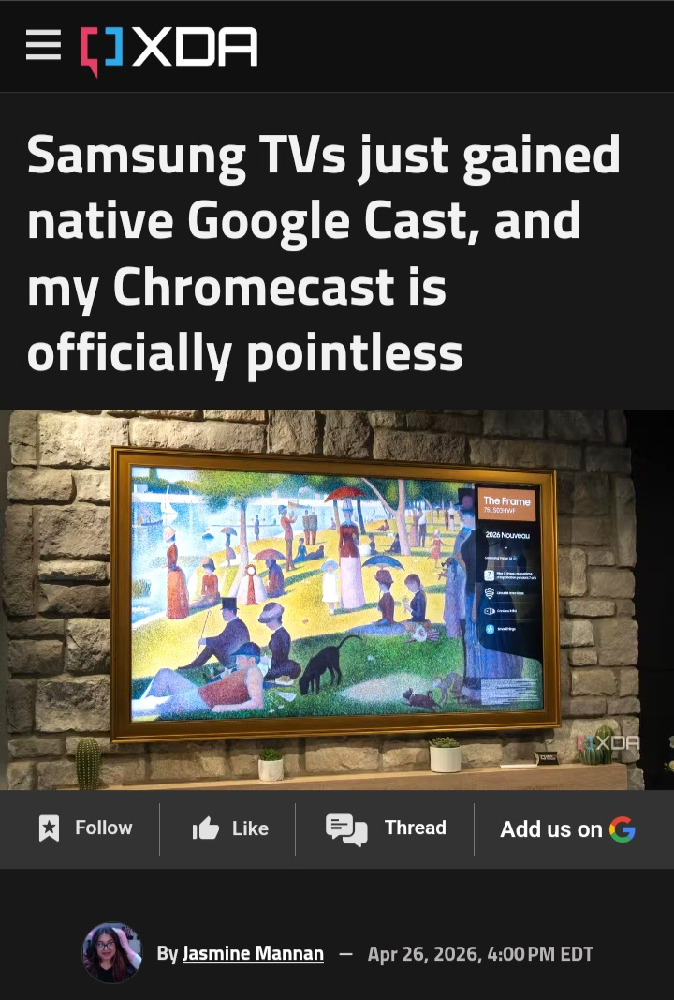

# This-Old-House

***A quick reference guide for tenants and new owners***

- 1. Dealing with bugs and pests. Knowing how to indentify them. Your housemates may spot it before you do.
- 2. Feeling encumbered or sticky? Funny looks? You might be carrying ***dead weight***. Let's talk about flies.
- 3. Ask around when picking a suitable home. Find out how long it's been vacant, there's a good chance the neighbors know something you don't.
- 4. What are trap houses and what do they look like?

# Dealing With Bugs & Pests

 ***What to Do When Facing a Bug Problem***
- Document Everything: Take photos/videos of pests, infestations, and keep record of personal damages.
- Give Written Notice: Send a formal, written (or electronic) notice to your landlord detailing the infestation and referencing your rights, as per local laws (like Colorado's HB19-1328 for bed bugs).
- Know Your Local Laws: Landlord responsibilities vary; check your state/city laws (e.g., Colorado requires landlords to inspect within 96 hours of bed bug notice).
- Warranty of Habitability: Landlords must maintain safe, habitable conditions.
- Chronic, hidden, malicious infestation: Sometimes it's what they don't say. Nobody mention the neighboorhood offender/s? That's not silence, it's concealment.

# Styling, Touch-ups, Furnishings, and Color Schemes
- Do not slack when it comes to the visual inspection. You could find yourself knee-deep in repair costs if you aren't vigilant about inspecting the surroundings.

- Noticed anything off yet, Joã? Probably not.

- ***Do not let anyone leave you feeling "boxed in" when choosing the color scheme or home furnishings.***
- Decking can make or break the look of your home. Look in between the seams for anything off-tone or potentially damaging to the appearance. ***Typically these types of issues are hidden in plain sight.***

- Not satisfied with the egregious stock presets, or ex owner's design flaws? You can do better, and best of all you don't need to be a technician either. Though if you're the do-it-yourself type, there's plenty of money to be saved. Alternatively, a hired hand can finish the job quickly when time is a concern. Which ever route you decide to take is up to you. Most importantly your house should feel like home, not living in someone else's juicy past. Every home owner has different taste, and only you know how to nail it.

- Unhappy with the unsightly ancient carpeting or creaks coming from the wooden floors? Remember this is ***your*** house. A home can settle over the years, but you shouldn't. In case you aren't getting the drift,

# No Longer Can You Trust The Search Results
- Wondering why the username tied to your home listing links to scam or fishing sites, but not even your own project? Likely the answer is right under your nose. Find out which of the 'in-house search engine optimization professionals' is to blame.
- ***They've been covering you in dirt since before you could open your eyes, in other words burying you.***

# When management's choices or behavior seems questionable, let it be known. Be loud when it's warrented.

- You can't. What's the matter? The living proof

# Time's up. Don't want to mention my tools? Let's talk about in-house predators, and sexual symbolism specifically targeting children

- Sexually suggestive child exploitative symbolism and what it looks like. Doesn't really get more blatent than smiling neon-colored childlike wenises. The production team if you can call it that, along with a heaping side of a.i. plausible deniability, has covered this nauseating puke-infested trash more than a dozen times. Talk about a whole nother level of nasty. 🤢

- Editor's Note: Commentary from Edwin

- Glad to see you're paying attention Edwin. Did you expect anything less from the de facto authority @Microsoft of technical documentation for Microsoft certified IT professionals? Surely I hope not.

# Hidden amenities even the realtor wasn't aware of

- Food for thought: You've discovered a grill seamlessly built into the facade of your rear deck, and it's been leaking indefinitely. That solves the mystery of the astronomical gas bill.
- Never let anyone including realtors, salesman, or previous owners get away with murdering your energy efficiency. If this has been going on for years unbeknownst to you, the associated costs are immense. 

- Attention home chefs: If you can't stomach a sampling of what you've been dishing out over the years, then you don't belong in the business. Beef, it's what's for dinner, and there's no one to blame but yourself.

- Don't let them pass the buck around. Hidden dangers such as gas leaks can potentially put your life at risk. If a large company has been forwarding potential hazards to individual buyers, that's egregious intent to harm, and an abuse of power. Remember, courts typically rule in favor of the home buyer who would otherwise be left ruined without recourse.

- Your house should never feel like an escape room. This is your reputation, career, and ultimately your life at stake. When a company is putting those in jeopardy to revive their dying brand over your reputational corpse, they need to be held to account to the fullest extent of the law.
- ***Let this be very clear and concise. You aren't Drake or Kendrick Lamar. Not only will you not profit from smear campaigns or sustained attacks, but the damage to your reputation and career is permanent and irreversible.***
